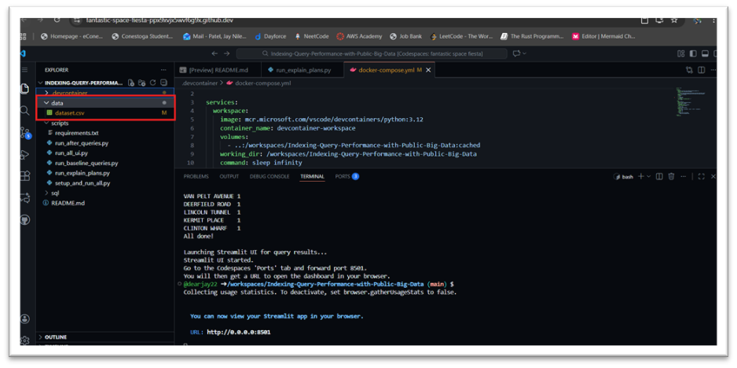
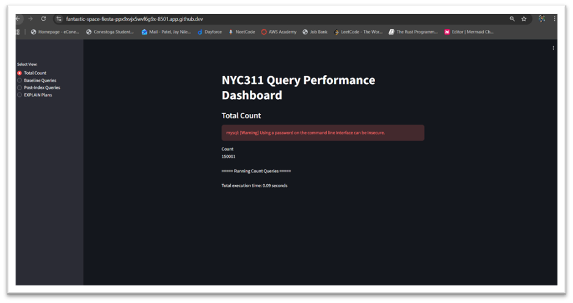
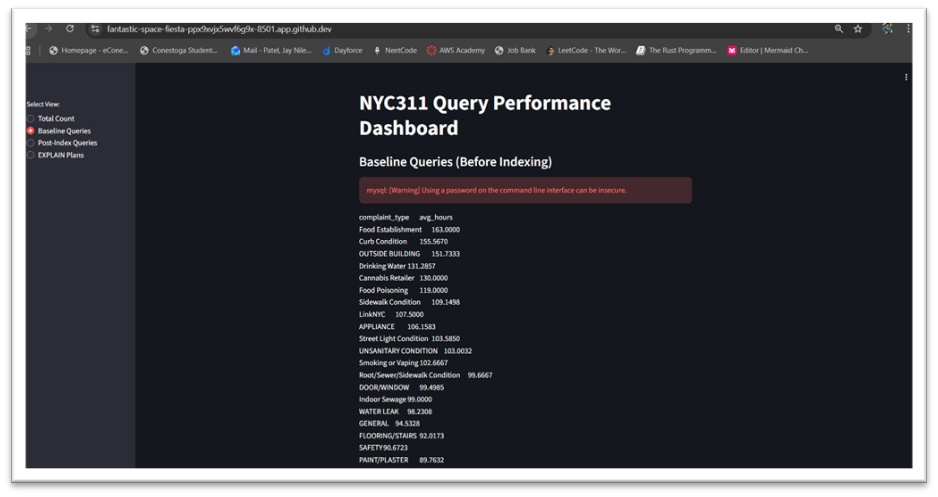
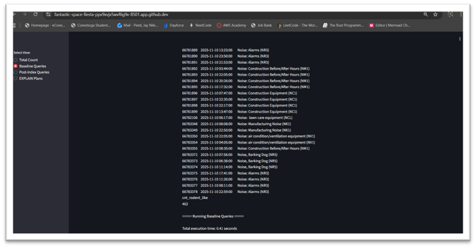
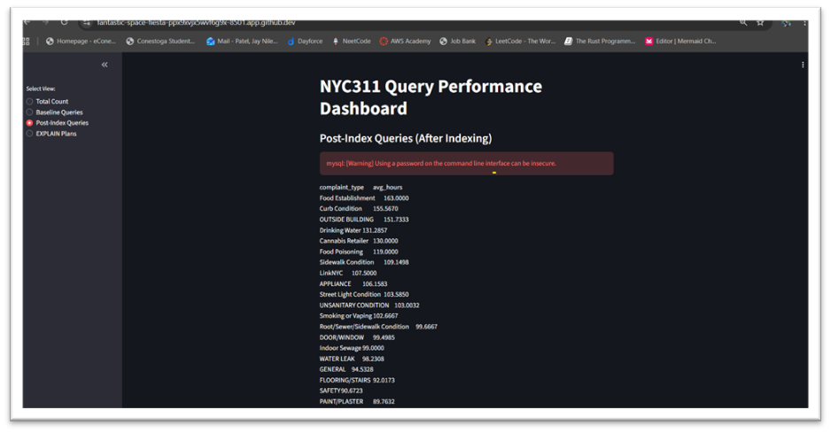
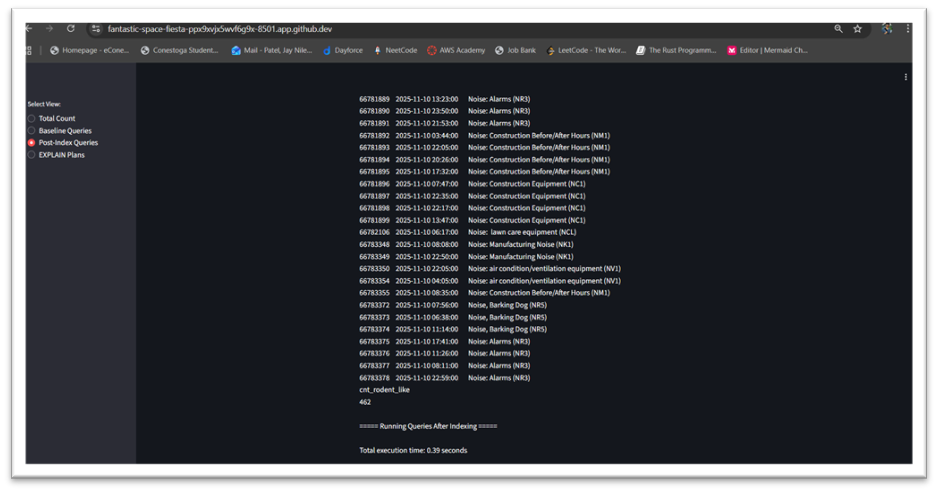
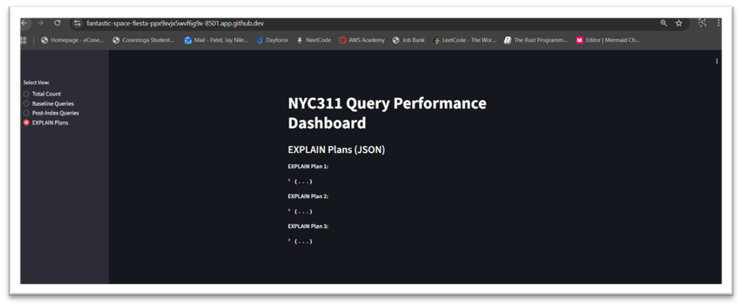
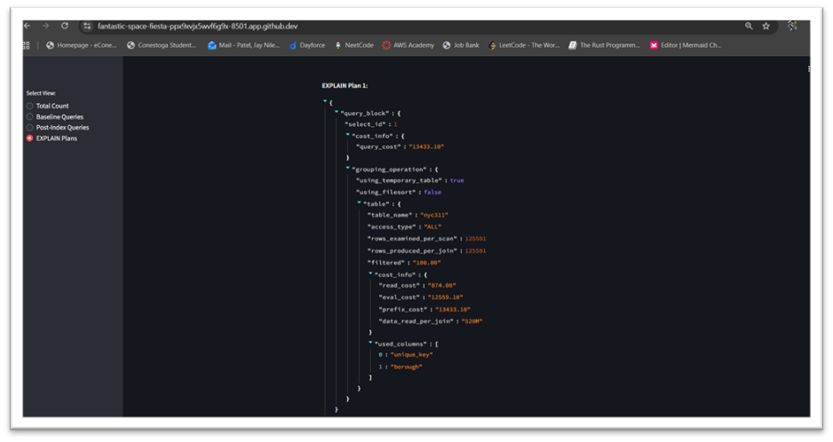

# NYC311 Query Performance & Indexing Project

This project demonstrates how indexing improves query performance on a large NYC311 dataset using MySQL, Python, and Streamlit.

## How to Run the Project

### 1. Open in GitHub Codespaces
The DevContainer automatically:
- Builds Python environment  
- Installs dependencies  
- Starts MySQL  
- Loads the dataset  

### 2. Start the Database & Analysis Scripts
```
python3 ./scripts/setup_and_run_all.py
```

### 3. Launch Streamlit Dashboard
```
streamlit run dashboard.py
```

Dashboard includes:
- Baseline timings  
- Post-index timings  
- EXPLAIN plans  
- Row count  


### Screenshots















